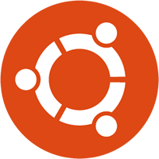

<p align="center">
  
  &nbsp;&nbsp;&nbsp;+&nbsp;&nbsp;&nbsp;
  
</p>

<h1 align="center">Ubuntu for Mac</h1>

<p align="center">
  <strong>Custom Ubuntu ISO with all Mac drivers pre-installed.</strong><br/>
  WiFi, keyboard, trackpad — everything works out of the box.
</p>

<p align="center">
  <a href="#-which-macs-are-supported">Supported Macs</a> •
  <a href="#-quick-start-install-ubuntu-on-your-mac">Quick Start</a> •
  <a href="#️-build-your-own-iso">Build Your Own</a> •
  <a href="#-dual-boot-with-macos">Dual Boot</a> •
  <a href="#-troubleshooting">Troubleshooting</a>
</p>

---

## 🤔 What is this?

If you've ever tried to install regular Ubuntu on a MacBook, you know the pain:
- ❌ **WiFi doesn't work** (Broadcom chips need proprietary drivers)
- ❌ **Keyboard/trackpad don't work** on 2016-2017 models (they use Apple SPI, not USB)
- ❌ **Fans spin at full speed** (no temperature control)
- ❌ **No function key mapping** (brightness, volume keys don't work right)

**This project fixes all of that.** We take a standard Ubuntu ISO and inject every driver your Mac needs, so when you boot the installer, **everything just works** — even WiFi during installation.

---

## 💻 Which Macs are supported?

**All Intel MacBooks from 2012 to 2020.** Here's what's included:

### ✅ Fully Supported (2012–2017)

| Mac Model | Year | WiFi | Keyboard | Trackpad | Audio | Fans |
|-----------|------|------|----------|----------|-------|------|
| MacBook Pro 15" | 2012-2015 | ✅ | ✅ | ✅ | ✅ | ✅ |
| MacBook Pro 13" | 2012-2015 | ✅ | ✅ | ✅ | ✅ | ✅ |
| MacBook Air 13" | 2012-2017 | ✅ | ✅ | ✅ | ✅ | ✅ |
| MacBook Air 11" | 2012-2015 | ✅ | ✅ | ✅ | ✅ | ✅ |
| MacBook 12" | 2015-2017 | ✅ | ✅¹ | ✅¹ | ✅ | ✅ |
| MacBook Pro 15" | 2016-2017 | ✅ | ✅¹ | ✅¹ | ✅ | ✅ |
| MacBook Pro 13" | 2016-2017 | ✅ | ✅¹ | ✅¹ | ✅ | ✅ |
| iMac | 2012-2020 | ✅ | ✅ | N/A | ✅ | ✅ |
| Mac Mini | 2012-2018 | ✅ | N/A | N/A | ✅ | ✅ |
| Mac Pro | 2013-2019 | ✅ | N/A | N/A | ✅ | ✅ |

> ¹ Uses Apple SPI driver (applespi) — included in the ISO and loaded automatically.

### ⚠️ Partial Support (2018–2020 T2 Macs)

These Macs have Apple's T2 security chip, which requires additional community drivers that are not yet available for Ubuntu 26.04. **WiFi and fan control will work**, but internal keyboard/trackpad may require an external USB keyboard during installation. Check [t2linux.org](https://t2linux.org/) for updates.

### ❌ Not Supported

- Apple Silicon Macs (M1, M2, M3, M4) — these use ARM, not Intel
- Macs older than 2012

---

## 🚀 Quick Start: Install Ubuntu on your Mac

### What you need

- A **Mac** from the supported list above
- A **USB flash drive** (at least 8 GB)
- The **custom ISO** (download from [Releases](../../releases))
- About **30 minutes** of time

### Step 1: Download the ISO

**Easiest way — one command:** Open Terminal and paste this:

```bash
curl -fsSL https://raw.githubusercontent.com/MuntasirMalek/ubuntu-for-mac/main/download.sh | bash
```

This will automatically download the ISO, combine all parts, verify the checksum, and give you the final `.iso` file. No technical knowledge needed — just wait for it to finish.

**Or manually:** Go to the [**Releases**](../../releases) page, download all `.part.*` files, and combine them:

```bash
cat ubuntu-26.04-desktop-amd64-mac-edition.part.* > ubuntu-26.04-desktop-amd64-mac-edition.iso
```

### Step 2: Flash the ISO to USB

#### On macOS (using Terminal)

1. **Plug in your USB drive**

2. **Find your USB drive name:**
   ```bash
   diskutil list
   ```
   Look for your USB drive — it will be something like `/dev/disk2` or `/dev/disk3`.
   It's usually the one matching your USB drive's size.

   > ⚠️ **Be very careful here.** Picking the wrong disk will erase the wrong drive!

3. **Unmount the USB drive:**
   ```bash
   diskutil unmountDisk /dev/disk2
   ```
   *(Replace `disk2` with your actual disk number)*

4. **Flash the ISO:**
   ```bash
   sudo dd if=ubuntu-26.04-desktop-amd64-mac-edition.iso of=/dev/rdisk2 bs=4m status=progress
   ```
   *(Replace `rdisk2` with your actual disk number — note the `r` prefix makes it faster)*

   This will take 5-10 minutes. Wait for it to finish.

5. **Eject:**
   ```bash
   diskutil eject /dev/disk2
   ```

#### On macOS (using balenaEtcher — easier)

1. Download [**balenaEtcher**](https://etcher.balena.io/) — it's free
2. Open it, select the ISO file
3. Select your USB drive
4. Click **Flash!**

That's it.

### Step 3: Boot from USB

1. **Shut down** your Mac completely
2. **Plug in** the USB drive
3. **Turn on** your Mac while holding the **Option (⌥) key**
4. You'll see a boot menu — select the orange/yellow **EFI Boot** drive
5. Ubuntu will start loading!

### Step 4: Install Ubuntu

Once Ubuntu boots from the USB, you have two choices:

#### Option A: Try Ubuntu first (recommended)
- Click **"Try Ubuntu"** to use it without installing
- Test that WiFi, keyboard, and trackpad work
- When ready, double-click the **"Install Ubuntu"** icon on the desktop

#### Option B: Install directly
- Click **"Install Ubuntu"**
- Follow the installer

#### During installation:
- **Language:** Pick your language
- **Keyboard:** Usually detected automatically
- **WiFi:** Connect to your WiFi network (it should work!)
- **Installation type:** See the [Dual Boot section](#-dual-boot-with-macos) below
- **Your info:** Set your name, username, and password

That's it! Reboot and enjoy Ubuntu on your Mac. 🎉

---

## 🔀 Dual Boot with macOS

Want to keep macOS AND have Ubuntu? Here's how.

### If you use OpenCore (like for macOS Sequoia on older Macs)

> **Good news:** OpenCore and Ubuntu work great together.

1. During Ubuntu installation, choose **"Something else"** (manual partitioning)
2. **Do NOT erase the whole disk** — this will delete macOS!
3. Find your target drive/partition:
   - If using your **internal SSD**: Shrink the macOS partition first using Disk Utility (from macOS), then use the free space for Ubuntu
   - If using an **external drive partition**: Select the partition you want to use
4. Create these partitions on the free space:

   | Partition | Size | Type | Mount Point |
   |-----------|------|------|-------------|
   | EFI | 512 MB | EFI System Partition | — |
   | Root | Remaining space | ext4 | `/` |
   | Swap | 4-8 GB | swap | — |

   > 💡 **Tip:** If an EFI partition already exists on the drive, you can share it — just make sure to **not format it**.

5. Set the **boot loader** to install on the same drive as Ubuntu
6. Click **Install**

### After installation

- **OpenCore** will remain your primary bootloader
- To boot Ubuntu: Hold **Option (⌥)** at startup and select the Ubuntu drive
- To boot macOS: Just restart normally (OpenCore handles it)

### Switching between macOS and Ubuntu

| To boot... | Do this... |
|------------|-----------|
| **macOS** | Just restart — OpenCore boots macOS by default |
| **Ubuntu** | Hold **Option (⌥)** at startup → select Ubuntu |

---

## 🛠️ Build Your Own ISO

Want to build the ISO yourself? You'll need **Docker** — that's it.

### Prerequisites

| Tool | Install | Why |
|------|---------|-----|
| Docker | [docker.com](https://www.docker.com/products/docker-desktop/) | Provides the Linux build environment |
| Git | Already on macOS | To clone this repo |

### Build steps

```bash
# 1. Clone this repo
git clone https://github.com/MuntasirMalek/ubuntu-for-mac.git
cd ubuntu-for-mac

# 2. Download the official Ubuntu ISO
# Get it from https://ubuntu.com/download/desktop
# Place it in this directory

# 3. Make sure Docker is running
docker info  # Should show server info, not an error

# 4. Build!
./build.sh ubuntu-26.04-desktop-amd64.iso
```

The build takes about **15-30 minutes** depending on your internet speed and CPU.

When it's done, you'll find `ubuntu-26.04-desktop-amd64-mac-edition.iso` in the same directory.

### Build profiles

You can build for specific Mac types to reduce ISO size:

```bash
# All Macs (default — recommended)
./build.sh ubuntu-26.04-desktop-amd64.iso

# Only pre-2018 Macs (no T2 chip)
./build.sh ubuntu-26.04-desktop-amd64.iso non-t2

# Only 2018-2020 Macs (T2 chip)
./build.sh ubuntu-26.04-desktop-amd64.iso t2
```

---

## 🔧 What's inside the ISO?

Here's exactly what we add to the standard Ubuntu ISO:

### Drivers

| Driver | What it does | Mac Models |
|--------|-------------|------------|
| `broadcom-sta-dkms` | **WiFi** — Broadcom wl driver | All Intel Macs |
| `applespi` | **Keyboard & trackpad** via SPI | 2016-2017 MacBooks |
| `hid-apple` config | **Function keys** work as F1-F12 | All Macs |
| `mbpfan` | **Fan control** — stops fans spinning at max | All MacBooks |
| `apple-gmux` config | **GPU switching** for dual-GPU MacBooks | 15" MacBook Pros |
| `apple-hda` config | **Audio** fix for Cirrus Logic codec | All Macs |
| `apple-nvme` config | **SSD suspend** fix for Apple NVMe | 2015+ Macs |

### Packages installed

| Package | Purpose |
|---------|---------|
| `broadcom-sta-dkms` | Broadcom WiFi driver |
| `bcmwl-kernel-source` | WiFi kernel module source |
| `dkms` | Auto-rebuilds drivers on kernel updates |
| `build-essential` | Compiler toolchain for DKMS |
| `linux-headers-generic` | Kernel headers for DKMS |
| `linux-firmware` | Firmware blobs |
| `bluez`, `bluez-tools` | Bluetooth stack |
| `mbpfan` | Fan control daemon |
| `powertop` | Battery optimization |
| `thermald` | Thermal management |
| `lm-sensors` | Temperature monitoring |
| `mesa-utils` | GPU diagnostics |

### Config files

| File | Location | Purpose |
|------|----------|---------|
| `broadcom-wl.conf` | `/etc/modprobe.d/` | Blacklists conflicting WiFi drivers |
| `hid-apple.conf` | `/etc/modprobe.d/` | F1-F12 default, key mapping |
| `apple-gmux.conf` | `/etc/modprobe.d/` | Uses integrated GPU by default |
| `apple-hda.conf` | `/etc/modprobe.d/` | Audio codec hint |
| `applespi.conf` | `/etc/modprobe.d/` | SPI keyboard driver dependencies |
| `apple-nvme.conf` | `/etc/modprobe.d/` | NVMe suspend/resume fix |
| `mbpfan.conf` | `/etc/` | Fan speed curves |
| `99-apple-trackpad.rules` | `/etc/udev/rules.d/` | Trackpad palm rejection & tuning |

---

## ✅ After Installation: Verify Everything Works

After installing Ubuntu, open a terminal and run:

```bash
sudo ubuntu-mac-setup
```

This runs a diagnostic that checks all your Mac hardware:

```
  Ubuntu Mac Setup — Post-Install Check
  ─────────────────────────────────────

  Mac model: MacBookPro11,5

  1. WiFi
    ✓ WiFi driver (wl/broadcom-sta) loaded — interface: wlp4s0

  2. Bluetooth
    ✓ Bluetooth service running
    ✓ Bluetooth adapter is UP

  3. Keyboard
    ✓ Apple keyboard driver (hid-apple) loaded
    ✓ Function key mode: 2 (F-keys default)

  4. Trackpad
    ✓ Trackpad detected by libinput

  5. Audio
    ✓ Intel HDA audio driver loaded
    ✓ Audio output device found

  6. Fan Control
    ✓ mbpfan is running
    ✓ CPU temperature: 52°C

  Setup check complete!
```

---

## ❓ Troubleshooting

### WiFi not working after install

```bash
# Check if the driver is loaded
lsmod | grep wl

# If not, try loading it manually
sudo modprobe -r b43 ssb bcma brcmsmac brcmfmac
sudo modprobe wl

# If that works, make it permanent
sudo dpkg-reconfigure broadcom-sta-dkms
```

### Keyboard/trackpad not working (2016-2017 MacBook)

These models use SPI. The drivers should load automatically, but if not:

```bash
# Load the SPI drivers
sudo modprobe applespi
sudo modprobe intel_lpss_pci
sudo modprobe spi_pxa2xx_platform

# Make them load at boot
echo -e "applespi\nintel_lpss_pci\nspi_pxa2xx_platform" | sudo tee -a /etc/initramfs-tools/modules
sudo update-initramfs -u
```

### Fans running at full speed

```bash
# Check if mbpfan is running
sudo systemctl status mbpfan

# If not, start and enable it
sudo systemctl enable mbpfan
sudo systemctl start mbpfan
```

### Function keys not working as F1-F12

```bash
# Check current mode (2 = F-keys default)
cat /sys/module/hid_apple/parameters/fnmode

# Change it temporarily
echo 2 | sudo tee /sys/module/hid_apple/parameters/fnmode

# The config file at /etc/modprobe.d/hid-apple.conf makes this permanent
```

### No sound

```bash
# Check if audio driver is loaded
lsmod | grep snd_hda_intel

# Try reinitializing
sudo alsactl init
sudo alsa force-reload
```

### Screen brightness not adjustable

```bash
# Try this — works on most MacBooks
echo 500 | sudo tee /sys/class/backlight/*/brightness

# Or install a brightness control tool
sudo apt install brightnessctl
brightnessctl set 50%
```

---

## 📁 Project Structure

```
ubuntu-for-mac/
├── build.sh                     # Main build script (start here)
├── Dockerfile                   # Docker build environment
├── README.md                    # You are here
├── config/
│   ├── packages/
│   │   ├── base.list            # Packages for ALL Macs
│   │   ├── non-t2.list          # Extra packages for 2012-2017 Macs
│   │   └── t2.list              # Extra packages for 2018-2020 T2 Macs
│   ├── modprobe/
│   │   ├── broadcom-wl.conf     # WiFi driver config
│   │   ├── hid-apple.conf       # Keyboard function keys
│   │   ├── apple-gmux.conf      # GPU switching
│   │   ├── apple-hda.conf       # Audio fix
│   │   ├── applespi.conf        # SPI keyboard/trackpad
│   │   └── apple-nvme.conf      # NVMe suspend fix
│   ├── udev/
│   │   └── 99-apple-trackpad.rules  # Trackpad tuning
│   └── mbpfan.conf              # Fan control settings
├── scripts/
│   ├── extract-iso.sh           # Phase 1: Extract ISO
│   ├── inject-drivers.sh        # Phase 2: Install drivers
│   ├── rebuild-iso.sh           # Phase 3: Rebuild ISO
│   └── post-install.sh          # Post-install diagnostic tool
└── docs/
    ├── DRIVER-AUDIT.md          # Full driver coverage documentation
    ├── DUAL-BOOT-GUIDE.md       # Detailed dual-boot instructions
    └── SUPPORTED-MODELS.md      # Compatibility matrix
```

---

## 🤝 Contributing

Found a bug? Have a Mac model that needs extra support? Contributions are welcome!

1. **Fork** this repository
2. **Create a branch** (`git checkout -b fix/my-macbook-model`)
3. **Make your changes**
4. **Test** by building the ISO and trying it
5. **Submit a PR** with details about what you fixed and which Mac model

### Easy ways to contribute

- 🧪 Test on your Mac and report results
- 📝 Improve documentation
- 🔧 Add config files for specific hardware
- 🐛 Report bugs in [Issues](../../issues)

---

## 📜 License

MIT License — do whatever you want with this. See [LICENSE](LICENSE) for details.

---

## 🙏 Credits

This project builds on the amazing work of:

- [Ubuntu](https://ubuntu.com/) — the operating system
- [Broadcom STA driver](https://packages.ubuntu.com/broadcom-sta-dkms) — WiFi
- [mbpfan](https://github.com/linux-on-mac/mbpfan) — fan control
- [macbook12-spi-driver](https://github.com/roadrunner2/macbook12-spi-driver) — SPI keyboard/trackpad
- [t2linux](https://t2linux.org/) — T2 Mac support
- [winterheart/broadcom-bt-firmware](https://github.com/winterheart/broadcom-bt-firmware) — Bluetooth firmware

---

<p align="center">
  Made with ❤️ for the Mac + Linux community<br/>
  <strong>No Mac should be without WiFi on Linux.</strong>
</p>
