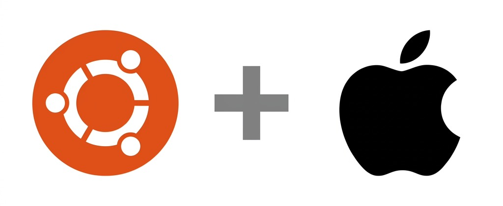

<p align="center">
  
</p>

<h1 align="center">Ubuntu for Mac</h1>

<p align="center">
  <strong>Custom Ubuntu ISO with all Mac drivers pre-installed.</strong><br/>
  WiFi, keyboard, trackpad — everything works out of the box.
</p>

<p align="center">
  <a href="#-quick-start">Quick Start</a> •
  <a href="#-supported-macs">Supported Macs</a> •
  <a href="#-dual-boot-with-macos">Dual Boot</a> •
  <a href="#️-build-your-own-iso">Build Your Own</a> •
  <a href="#-troubleshooting">Troubleshooting</a>
</p>

---

## 🚀 Quick Start

### What you need

- An **Intel Mac** (2012–2020)
- A **USB flash drive** (8 GB or bigger)
- About **30 minutes**

### Step 1: Download the ISO

Open **Terminal** and paste this one command:

```bash
curl -fsSL https://raw.githubusercontent.com/MuntasirMalek/ubuntu-for-mac/main/download.sh | bash
```

That's it — it downloads everything, combines the files, and verifies the checksum for you.

> **Or manually:** Go to [Releases](../../releases), download all `.part.*` files, then run:
> ```bash
> cat ubuntu-26.04-desktop-amd64-mac-edition.part.* > ubuntu-26.04-desktop-amd64-mac-edition.iso
> ```

### Step 2: Flash to USB

**Easiest way** — use [balenaEtcher](https://etcher.balena.io/) (free):
1. Open it, select the ISO
2. Select your USB drive
3. Click **Flash!**

**Or use Terminal:**

```bash
# Find your USB drive
diskutil list

# Unmount it (replace disk2 with yours)
diskutil unmountDisk /dev/disk2

# Flash (replace rdisk2 with yours — the 'r' makes it faster)
sudo dd if=ubuntu-26.04-desktop-amd64-mac-edition.iso of=/dev/rdisk2 bs=4m status=progress

# Eject
diskutil eject /dev/disk2
```

> ⚠️ **Be careful with `diskutil list`.** Pick the disk that matches your USB drive's size. Wrong disk = wrong drive erased.

### Step 3: Boot from USB

1. **Shut down** your Mac
2. **Plug in** the USB drive
3. **Turn on** while holding **Option (⌥)**
4. Select the **EFI Boot** drive
5. Ubuntu loads!

### Step 4: Install

1. Click **"Try Ubuntu"** first to test WiFi, keyboard, trackpad
2. When ready, double-click **"Install Ubuntu"** on the desktop
3. Follow the installer:
   - Pick your language
   - Connect to WiFi (it works!)
   - Choose your install type (see [Dual Boot](#-dual-boot-with-macos) if keeping macOS)
   - Set your name and password
4. Reboot — done! 🎉

### Step 5: Verify hardware

After install, open Terminal and run:

```bash
sudo ubuntu-mac-setup
```

It checks WiFi, keyboard, trackpad, audio, fans — tells you if everything is working.

---

## 💻 Supported Macs

**All Intel Macs from 2012 to 2020.**

### ✅ Full Support (2012–2017)

| Mac Model | Year | WiFi | Keyboard | Trackpad | Audio | Fans |
|-----------|------|------|----------|----------|-------|------|
| MacBook Pro 15" | 2012-2015 | ✅ | ✅ | ✅ | ✅ | ✅ |
| MacBook Pro 13" | 2012-2015 | ✅ | ✅ | ✅ | ✅ | ✅ |
| MacBook Air 13" | 2012-2017 | ✅ | ✅ | ✅ | ✅ | ✅ |
| MacBook Air 11" | 2012-2015 | ✅ | ✅ | ✅ | ✅ | ✅ |
| MacBook 12" | 2015-2017 | ✅ | ✅¹ | ✅¹ | ✅ | ✅ |
| MacBook Pro 15" | 2016-2017 | ✅ | ✅¹ | ✅¹ | ✅ | ✅ |
| MacBook Pro 13" | 2016-2017 | ✅ | ✅¹ | ✅¹ | ✅ | ✅ |
| iMac | 2012-2020 | ✅ | ✅ | N/A | ✅ | ✅ |
| Mac Mini | 2012-2018 | ✅ | N/A | N/A | ✅ | ✅ |
| Mac Pro | 2013-2019 | ✅ | N/A | N/A | ✅ | ✅ |

> ¹ Uses Apple SPI driver (applespi) — included in the ISO and loaded automatically.

### ⚠️ Partial Support (2018–2020 T2 Macs)

WiFi and fan control work. Internal keyboard/trackpad may need an external USB keyboard during install. Check [t2linux.org](https://t2linux.org/) for updates.

### ❌ Not Supported

- Apple Silicon (M1/M2/M3/M4) — ARM, not Intel
- Macs older than 2012

---

## 🤔 What is this?

If you've ever installed regular Ubuntu on a Mac, you know the pain:
- ❌ **WiFi doesn't work** (Broadcom chips need proprietary drivers)
- ❌ **Keyboard/trackpad don't work** on 2016-2017 models (they use Apple SPI, not USB)
- ❌ **Fans spin at full speed** (no temperature control)
- ❌ **No function key mapping** (brightness, volume keys don't work)

**This project fixes all of that.** We take a standard Ubuntu ISO and inject every driver your Mac needs, so when you boot the installer, **everything just works** — even WiFi during installation.

---

## 🔀 Dual Boot with macOS

Want to keep macOS AND have Ubuntu? Here's how.

### If you use OpenCore (like for macOS Sequoia on older Macs)

> **Good news:** OpenCore and Ubuntu work great together.

1. During Ubuntu installation, choose **"Something else"** (manual partitioning)
2. **Do NOT erase the whole disk** — this will delete macOS!
3. Find your target drive/partition:
   - If using your **internal SSD**: Shrink the macOS partition first using Disk Utility (from macOS), then use the free space for Ubuntu
   - If using an **external drive partition**: Select the partition you want to use
4. Create these partitions on the free space:

   | Partition | Size | Type | Mount Point |
   |-----------|------|------|-------------|
   | EFI | 512 MB | EFI System Partition | — |
   | Root | Remaining space | ext4 | `/` |
   | Swap | 4-8 GB | swap | — |

   > 💡 **Tip:** If an EFI partition already exists on the drive, you can share it — just make sure to **not format it**.

5. Set the **boot loader** to install on the same drive as Ubuntu
6. Click **Install**

### After installation

| To boot... | Do this... |
|------------|-----------|
| **macOS** | Just restart — OpenCore boots macOS by default |
| **Ubuntu** | Hold **Option (⌥)** at startup → select Ubuntu |

---

## 🛠️ Build Your Own ISO

Want to build the ISO yourself? You'll need **Docker** — that's it.

### Prerequisites

| Tool | Install | Why |
|------|---------|-----|
| Docker | [docker.com](https://www.docker.com/products/docker-desktop/) | Provides the Linux build environment |
| Git | Already on macOS | To clone this repo |

### Build steps

```bash
# 1. Clone this repo
git clone https://github.com/MuntasirMalek/ubuntu-for-mac.git
cd ubuntu-for-mac

# 2. Download the official Ubuntu ISO
# Get it from https://ubuntu.com/download/desktop
# Place it in this directory

# 3. Make sure Docker is running
docker info  # Should show server info, not an error

# 4. Build!
./build.sh ubuntu-26.04-desktop-amd64.iso
```

The build takes about **15-30 minutes** depending on your internet speed and CPU.

When it's done, you'll find `ubuntu-26.04-desktop-amd64-mac-edition.iso` in the same directory.

### Build profiles

```bash
# All Macs (default — recommended)
./build.sh ubuntu-26.04-desktop-amd64.iso

# Only pre-2018 Macs (no T2 chip)
./build.sh ubuntu-26.04-desktop-amd64.iso non-t2

# Only 2018-2020 Macs (T2 chip)
./build.sh ubuntu-26.04-desktop-amd64.iso t2
```

---

## ❓ Troubleshooting

### WiFi not working after install

```bash
# Check if the driver is loaded
lsmod | grep wl

# If not, try loading it manually
sudo modprobe -r b43 ssb bcma brcmsmac brcmfmac
sudo modprobe wl

# If that works, make it permanent
sudo dpkg-reconfigure broadcom-sta-dkms
```

### Keyboard/trackpad not working (2016-2017 MacBook)

These models use SPI. The drivers should load automatically, but if not:

```bash
# Load the SPI drivers
sudo modprobe applespi
sudo modprobe intel_lpss_pci
sudo modprobe spi_pxa2xx_platform

# Make them load at boot
echo -e "applespi\nintel_lpss_pci\nspi_pxa2xx_platform" | sudo tee -a /etc/initramfs-tools/modules
sudo update-initramfs -u
```

### Fans running at full speed

```bash
# Check if mbpfan is running
sudo systemctl status mbpfan

# If not, start and enable it
sudo systemctl enable mbpfan
sudo systemctl start mbpfan
```

### Function keys not working as F1-F12

```bash
# Check current mode (2 = F-keys default)
cat /sys/module/hid_apple/parameters/fnmode

# Change it temporarily
echo 2 | sudo tee /sys/module/hid_apple/parameters/fnmode

# The config file at /etc/modprobe.d/hid-apple.conf makes this permanent
```

### No sound

```bash
# Check if audio driver is loaded
lsmod | grep snd_hda_intel

# Try reinitializing
sudo alsactl init
sudo alsa force-reload
```

### Screen brightness not adjustable

```bash
# Try this — works on most MacBooks
echo 500 | sudo tee /sys/class/backlight/*/brightness

# Or install a brightness control tool
sudo apt install brightnessctl
brightnessctl set 50%
```

---

## 🔧 What's inside the ISO?

<details>
<summary><strong>Click to see all drivers, packages, and config files</strong></summary>

### Drivers

| Driver | What it does | Mac Models |
|--------|-------------|------------|
| `broadcom-sta-dkms` | **WiFi** — Broadcom wl driver | All Intel Macs |
| `applespi` | **Keyboard & trackpad** via SPI | 2016-2017 MacBooks |
| `hid-apple` config | **Function keys** work as F1-F12 | All Macs |
| `mbpfan` | **Fan control** — stops fans spinning at max | All MacBooks |
| `apple-gmux` config | **GPU switching** for dual-GPU MacBooks | 15" MacBook Pros |
| `apple-hda` config | **Audio** fix for Cirrus Logic codec | All Macs |
| `apple-nvme` config | **SSD suspend** fix for Apple NVMe | 2015+ Macs |

### Packages installed

| Package | Purpose |
|---------|---------|
| `broadcom-sta-dkms` | Broadcom WiFi driver |
| `bcmwl-kernel-source` | WiFi kernel module source |
| `dkms` | Auto-rebuilds drivers on kernel updates |
| `build-essential` | Compiler toolchain for DKMS |
| `linux-headers-generic` | Kernel headers for DKMS |
| `linux-firmware` | Firmware blobs |
| `bluez`, `bluez-tools` | Bluetooth stack |
| `mbpfan` | Fan control daemon |
| `powertop` | Battery optimization |
| `thermald` | Thermal management |
| `lm-sensors` | Temperature monitoring |
| `mesa-utils` | GPU diagnostics |

### Config files

| File | Location | Purpose |
|------|----------|---------|
| `broadcom-wl.conf` | `/etc/modprobe.d/` | Blacklists conflicting WiFi drivers |
| `hid-apple.conf` | `/etc/modprobe.d/` | F1-F12 default, key mapping |
| `apple-gmux.conf` | `/etc/modprobe.d/` | Uses integrated GPU by default |
| `apple-hda.conf` | `/etc/modprobe.d/` | Audio codec hint |
| `applespi.conf` | `/etc/modprobe.d/` | SPI keyboard/trackpad dependencies |
| `apple-nvme.conf` | `/etc/modprobe.d/` | NVMe suspend/resume fix |
| `mbpfan.conf` | `/etc/` | Fan speed curves |
| `99-apple-trackpad.rules` | `/etc/udev/rules.d/` | Trackpad palm rejection & tuning |

</details>

---

## 📁 Project Structure

```
ubuntu-for-mac/
├── build.sh                     # Main build script (start here)
├── download.sh                  # One-command ISO downloader
├── Dockerfile                   # Docker build environment
├── README.md                    # You are here
├── config/
│   ├── packages/
│   │   ├── base.list            # Packages for ALL Macs
│   │   ├── non-t2.list          # Extra packages for 2012-2017 Macs
│   │   └── t2.list              # Extra packages for 2018-2020 T2 Macs
│   ├── modprobe/
│   │   ├── broadcom-wl.conf     # WiFi driver config
│   │   ├── hid-apple.conf       # Keyboard function keys
│   │   ├── apple-gmux.conf      # GPU switching
│   │   ├── apple-hda.conf       # Audio fix
│   │   ├── applespi.conf        # SPI keyboard/trackpad
│   │   └── apple-nvme.conf      # NVMe suspend fix
│   ├── udev/
│   │   └── 99-apple-trackpad.rules  # Trackpad tuning
│   └── mbpfan.conf              # Fan control settings
├── scripts/
│   ├── extract-iso.sh           # Phase 1: Extract ISO
│   ├── inject-drivers.sh        # Phase 2: Install drivers
│   ├── rebuild-iso.sh           # Phase 3: Rebuild ISO
│   └── post-install.sh          # Post-install diagnostic tool
└── docs/
    ├── DRIVER-AUDIT.md          # Full driver coverage documentation
    ├── DUAL-BOOT-GUIDE.md       # Detailed dual-boot instructions
    └── SUPPORTED-MODELS.md      # Compatibility matrix
```

---

## 🤝 Contributing

Found a bug? Have a Mac model that needs extra support? Contributions are welcome!

1. **Fork** this repository
2. **Create a branch** (`git checkout -b fix/my-macbook-model`)
3. **Make your changes**
4. **Test** by building the ISO and trying it
5. **Submit a PR** with details about what you fixed and which Mac model

### Easy ways to contribute

- 🧪 Test on your Mac and report results
- 📝 Improve documentation
- 🔧 Add config files for specific hardware
- 🐛 Report bugs in [Issues](../../issues)

---

## 📜 License

MIT License — do whatever you want with this. See [LICENSE](LICENSE) for details.

---

## 🙏 Credits

This project builds on the amazing work of:

- [Ubuntu](https://ubuntu.com/) — the operating system
- [Broadcom STA driver](https://packages.ubuntu.com/broadcom-sta-dkms) — WiFi
- [mbpfan](https://github.com/linux-on-mac/mbpfan) — fan control
- [macbook12-spi-driver](https://github.com/roadrunner2/macbook12-spi-driver) — SPI keyboard/trackpad
- [t2linux](https://t2linux.org/) — T2 Mac support
- [winterheart/broadcom-bt-firmware](https://github.com/winterheart/broadcom-bt-firmware) — Bluetooth firmware

---

<p align="center">
  Made with ❤️ for the Mac + Linux community<br/>
  <strong>No Mac should be without WiFi on Linux.</strong>
</p>
